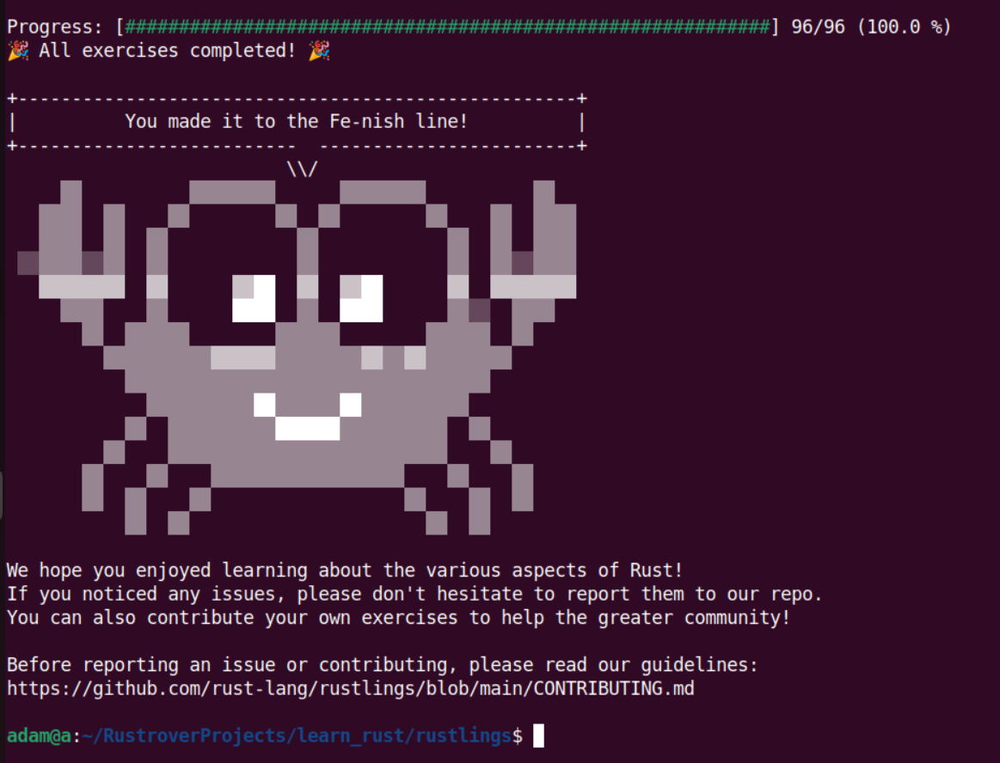

# learn_rust
A repository for tracking my progress for learning the Rust programming language.

## My Rust Roadmap
✅ - Done

⬅️ - Doing

⚫ - Paused
1. Read [The Book](https://doc.rust-lang.org/stable/book/) (only read) ✅
2. Read the [interactive version of The Book](https://rust-book.cs.brown.edu/), code along, finish all exercises ✅
3. [Rustlings](https://github.com/rust-lang/rustlings) ✅
4. [Rust by Example](https://doc.rust-lang.org/stable/rust-by-example/) ⬅️
5. [Rust by Practice](https://practice.rs/why-exercise.html)
6. Learn Haskell (to learn FP, iterators, ...) ([Real World Haskell](https://www.amazon.de/Real-World-Haskell-Bryan-OSullivan/dp/0596514980))
7. Go through [specific learning resources](https://github.com/ctjhoa/rust-learning) ([CLI](https://rust-cli.github.io/book/), Web servers), build projects
8. [Codecrafters](https://app.codecrafters.io/tracks/rust)

---
## Rustlings Certificate
